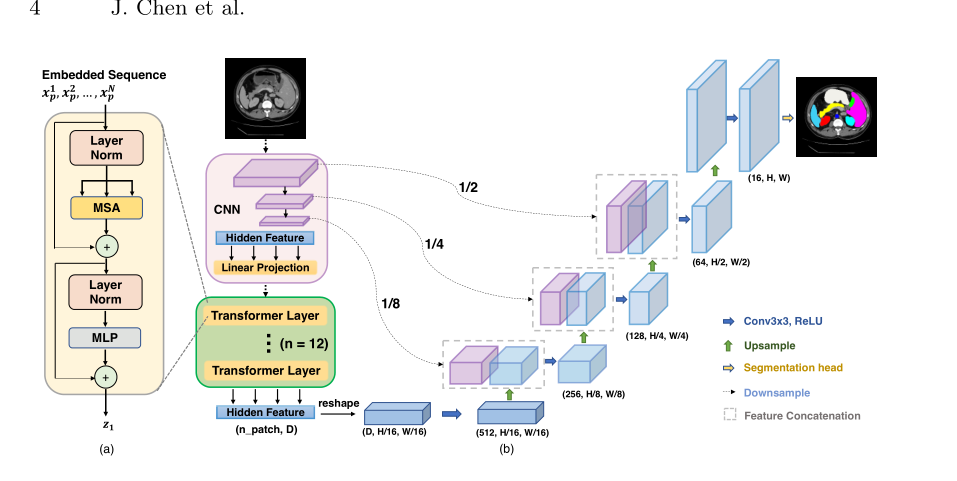
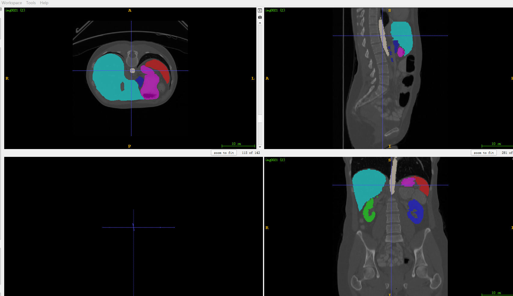
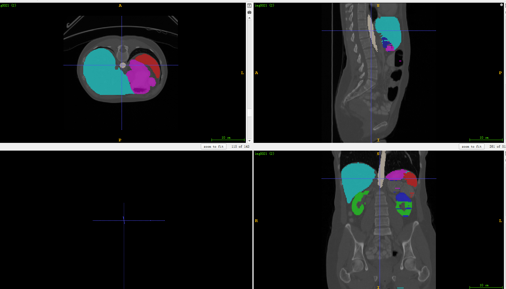
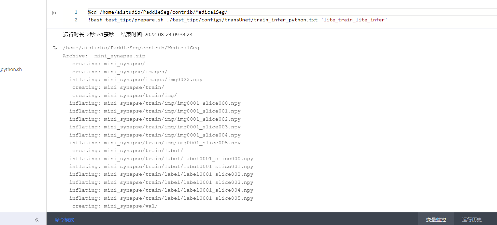
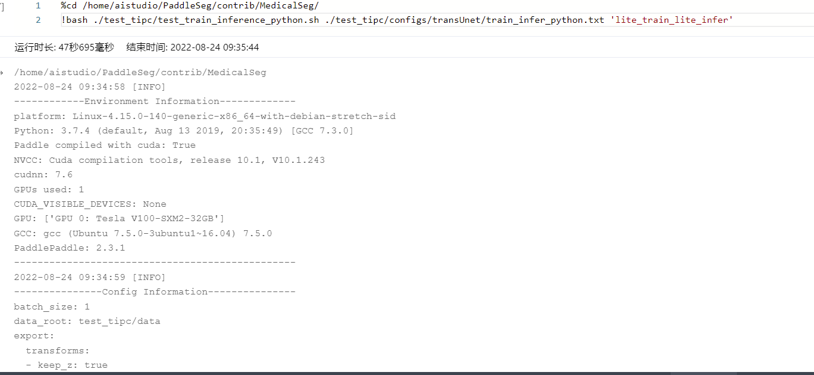
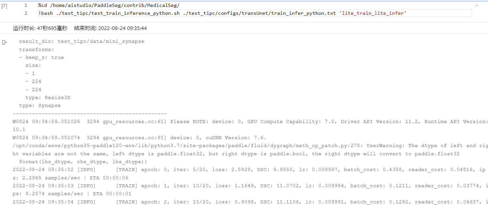
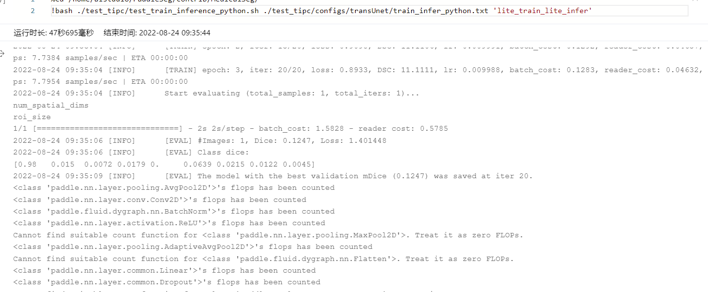
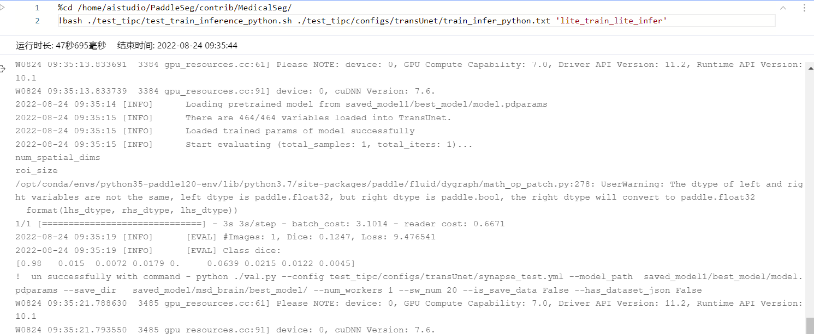
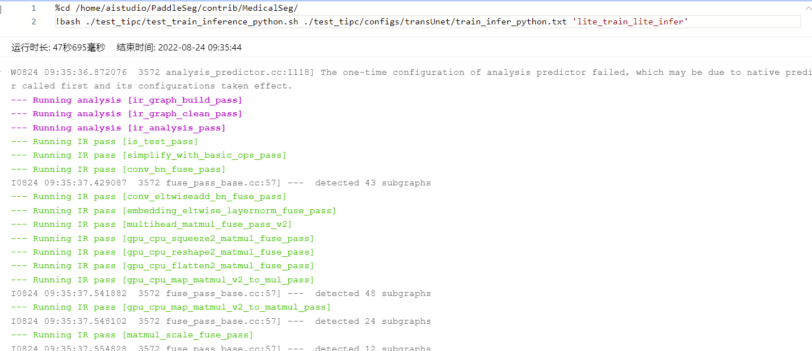
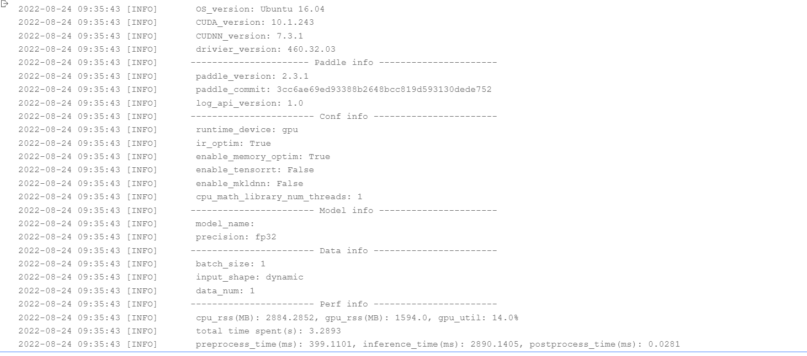

 # 基于Paddle复现
## 1.论文简介
TransUNet: Transformers Make Strong Encoders for Medical Image Segmentation(https://arxiv.org/pdf/2102.04306v1.pdf)，



到目前为止transformer在计算机视觉上的应用越来越多，并且取得了非常不错的精度。
本repo介绍一种基于transformer与传统convolution想结合的模型TransUnet。
TransUnet使用了resnet进行了16倍的下采样充当transformer的patch的职责。
然后将resnet下采样后的特征图输入到了vit中进行了transformer操作。
最终将transformer出来特特征图上采样后与resnet的浅层图cascade操作保证了分割的细节信息。
此模型实质是基于2d的通过训练一个个slicer，最终prediction的时候也是预测出所有slicer在重构成为3d的结果

**参考实现**：
https://github.com/Beckschen/TransUNet

## 2.复现精度
注意：本文复现环境是在baiduaistudio上的notebook环境，所以有些配置参数也是基于notebook环境的。
如果想完全跑通该repo在其他环境下也可自行更改一些路径配置，比较简单此处不在啰嗦。

在synapse的测试集的测试效果如下表,达到验收指标，dice-Score=0.7748   满足精度要求 0.7801

2022-08-23 12:24:53 [INFO]	[EVAL] #Images: 12, Dice: 0.7801, Loss: 1.607945
2022-08-23 12:24:53 [INFO]	[EVAL] Class dice: 
[0.9953 0.8945 0.7191 0.6712 0.6318 0.956  0.7669 0.8315 0.5543]


精度和loss可以在train.log中看到训练的详细过程

## 3.环境依赖
通过以下命令安装对应依赖
```shell
!pip install -r PaddleSeg/contrib/MedicalSeg/requirements.txt
```

## 4.数据集

下载地址:

[https://www.synapse.org/#!Synapse:syn3193805/wiki/217789)

数据集从下载到解压预处理使用prepare_synapse.py处理。执行以下命令。

```shell
cd PaddleSeg/contrib/MedicalSeg/tools
python prepare_synapse.py --raw_folder /home/aistudio/SynaDataset/RawData/Training \
--save_path /home/aistudio/SynaDataset/preprocessed --split_val 0.4
```

## 5.快速开始

### 模型训练

运行一下命令进行模型训练，在训练过程中会对模型进行评估，启用了VisualDL日志功能，运行之后在`` 文件夹下找到对应的日志文件

```shell
# Train the model: see the train.py for detailed explanation on script args
cd PaddleSeg/contrib/MedicalSeg/
!python train.py --config /home/aistudio/PaddleSeg/contrib/MedicalSeg/configs/synapse/transUnet_synapse.yml \
 --save_interval 1000 --save_dir /home/aistudio/train_model_out --num_workers 4 --do_eval \
 --log_iters 20 --sw_num 1 --is_save_data False --has_dataset_json False >>train.log
```

**参数介绍**：
--config:配置路径
--save_dir:模型输出文件夹
--save_interval :保存间隔，单位iter
--log_iters：记录日志间隔，单位iter
--num_workers:读取数据集的worker数量，一般等同于batchsize
--do_eval --use_vdl \   使用eval， 使用vdl记录
--keep_checkpoint_max ：最大保存的检查点数量


其他超参数已经设置好。最后一个epoch结束，模型验证日志在train.log 下面截取一段发现10000iter时候已经超过论文要求：
```shell
2022-08-23 11:33:42 [INFO]	[TRAIN] epoch: 86, iter: 8860/14000, loss: 0.1606, DSC: 87.8240, lr: 0.004059, batch_cost: 0.4611, reader_cost: 0.03107, ips: 52.0484 samples/sec | ETA 00:39:30
2022-08-23 11:33:53 [INFO]	[TRAIN] epoch: 87, iter: 8880/14000, loss: 0.1519, DSC: 88.2869, lr: 0.004045, batch_cost: 0.5400, reader_cost: 0.11823, ips: 44.4417 samples/sec | ETA 00:46:04
2022-08-23 11:34:03 [INFO]	[TRAIN] epoch: 87, iter: 8900/14000, loss: 0.1623, DSC: 87.6322, lr: 0.004031, batch_cost: 0.5077, reader_cost: 0.07389, ips: 47.2683 samples/sec | ETA 00:43:09
2022-08-23 11:34:13 [INFO]	[TRAIN] epoch: 87, iter: 8920/14000, loss: 0.1471, DSC: 88.9323, lr: 0.004016, batch_cost: 0.5021, reader_cost: 0.06903, ips: 47.7986 samples/sec | ETA 00:42:30
2022-08-23 11:34:23 [INFO]	[TRAIN] epoch: 87, iter: 8940/14000, loss: 0.1508, DSC: 88.7284, lr: 0.004002, batch_cost: 0.4763, reader_cost: 0.04740, ips: 50.3910 samples/sec | ETA 00:40:09
2022-08-23 11:34:32 [INFO]	[TRAIN] epoch: 87, iter: 8960/14000, loss: 0.1501, DSC: 88.5421, lr: 0.003988, batch_cost: 0.4836, reader_cost: 0.05262, ips: 49.6233 samples/sec | ETA 00:40:37
2022-08-23 11:34:43 [INFO]	[TRAIN] epoch: 88, iter: 8980/14000, loss: 0.1653, DSC: 87.1675, lr: 0.003974, batch_cost: 0.5260, reader_cost: 0.10605, ips: 45.6287 samples/sec | ETA 00:44:00
2022-08-23 11:34:53 [INFO]	[TRAIN] epoch: 88, iter: 9000/14000, loss: 0.1501, DSC: 88.4747, lr: 0.003959, batch_cost: 0.4799, reader_cost: 0.04905, ips: 50.0078 samples/sec | ETA 00:39:59
2022-08-23 11:34:53 [INFO]	Start evaluating (total_samples: 12, total_iters: 12)...
2022-08-23 11:35:41 [INFO]	[EVAL] #Images: 12, Dice: 0.7739, Loss: 0.393199
2022-08-23 11:35:41 [INFO]	[EVAL] Class dice: 
[0.9954 0.8964 0.6998 0.6628 0.6569 0.9561 0.7534 0.8398 0.5039]
2022-08-23 11:35:44 [INFO]	[EVAL] The model with the best validation mDice (0.7776) was saved at iter 5000.
2022-08-23 11:35:54 [INFO]	[TRAIN] epoch: 88, iter: 9020/14000, loss: 0.1546, DSC: 88.2034, lr: 0.003945, batch_cost: 0.4891, reader_cost: 0.06245, ips: 49.0722 samples/sec | ETA 00:40:35
2022-08-23 11:36:03 [INFO]	[TRAIN] epoch: 88, iter: 9040/14000, loss: 0.1514, DSC: 88.6246, lr: 0.003931, batch_cost: 0.4807, reader_cost: 0.05513, ips: 49.9299 samples/sec | ETA 00:39:44
2022-08-23 11:36:13 [INFO]	[TRAIN] epoch: 88, iter: 9060/14000, loss: 0.1492, DSC: 88.6966, lr: 0.003917, batch_cost: 0.5136, reader_cost: 0.08030, ips: 46.7281 samples/sec | ETA 00:42:17
2022-08-23 11:36:24 [INFO]	[TRAIN] epoch: 89, iter: 9080/14000, loss: 0.1587, DSC: 87.9150, lr: 0.003902, batch_cost: 0.5456, reader_cost: 0.12079, ips: 43.9854 samples/sec | ETA 00:44:44
2022-08-23 11:36:34 [INFO]	[TRAIN] epoch: 89, iter: 9100/14000, loss: 0.1663, DSC: 87.0868, lr: 0.003888, batch_cost: 0.4898, reader_cost: 0.05604, ips: 48.9958 samples/sec | ETA 00:40:00
2022-08-23 11:36:44 [INFO]	[TRAIN] epoch: 89, iter: 9120/14000, loss: 0.1565, DSC: 88.1215, lr: 0.003874, batch_cost: 0.4716, reader_cost: 0.04139, ips: 50.8890 samples/sec | ETA 00:38:21
2022-08-23 11:36:53 [INFO]	[TRAIN] epoch: 89, iter: 9140/14000, loss: 0.1532, DSC: 88.6839, lr: 0.003860, batch_cost: 0.4674, reader_cost: 0.03449, ips: 51.3480 samples/sec | ETA 00:37:51
2022-08-23 11:37:02 [INFO]	[TRAIN] epoch: 89, iter: 9160/14000, loss: 0.1497, DSC: 88.3040, lr: 0.003845, batch_cost: 0.4625, reader_cost: 0.03103, ips: 51.8921 samples/sec | ETA 00:37:18
2022-08-23 11:37:12 [INFO]	[TRAIN] epoch: 90, iter: 9180/14000, loss: 0.1591, DSC: 87.7245, lr: 0.003831, batch_cost: 0.4688, reader_cost: 0.04302, ips: 51.1971 samples/sec | ETA 00:37:39
2022-08-23 11:37:23 [INFO]	[TRAIN] epoch: 90, iter: 9200/14000, loss: 0.1512, DSC: 88.7556, lr: 0.003817, batch_cost: 0.5687, reader_cost: 0.13770, ips: 42.2048 samples/sec | ETA 00:45:29
2022-08-23 11:37:32 [INFO]	[TRAIN] epoch: 90, iter: 9220/14000, loss: 0.1564, DSC: 88.2347, lr: 0.003802, batch_cost: 0.4673, reader_cost: 0.03480, ips: 51.3579 samples/sec | ETA 00:37:13
2022-08-23 11:37:42 [INFO]	[TRAIN] epoch: 90, iter: 9240/14000, loss: 0.1650, DSC: 87.2661, lr: 0.003788, batch_cost: 0.4867, reader_cost: 0.05343, ips: 49.3077 samples/sec | ETA 00:38:36
2022-08-23 11:37:52 [INFO]	[TRAIN] epoch: 90, iter: 9260/14000, loss: 0.1557, DSC: 87.7225, lr: 0.003774, batch_cost: 0.4797, reader_cost: 0.05044, ips: 50.0329 samples/sec | ETA 00:37:53
2022-08-23 11:38:01 [INFO]	[TRAIN] epoch: 90, iter: 9280/14000, loss: 0.1642, DSC: 87.2408, lr: 0.003759, batch_cost: 0.4962, reader_cost: 0.06847, ips: 48.3710 samples/sec | ETA 00:39:01
2022-08-23 11:38:17 [INFO]	[TRAIN] epoch: 91, iter: 9300/14000, loss: 0.1627, DSC: 87.7872, lr: 0.003745, batch_cost: 0.7971, reader_cost: 0.37452, ips: 30.1076 samples/sec | ETA 01:02:26
2022-08-23 11:38:27 [INFO]	[TRAIN] epoch: 91, iter: 9320/14000, loss: 0.1509, DSC: 88.5331, lr: 0.003731, batch_cost: 0.4878, reader_cost: 0.02674, ips: 49.2012 samples/sec | ETA 00:38:02
2022-08-23 11:38:37 [INFO]	[TRAIN] epoch: 91, iter: 9340/14000, loss: 0.1591, DSC: 87.8059, lr: 0.003716, batch_cost: 0.4723, reader_cost: 0.04050, ips: 50.8195 samples/sec | ETA 00:36:40
2022-08-23 11:38:46 [INFO]	[TRAIN] epoch: 91, iter: 9360/14000, loss: 0.1516, DSC: 88.3536, lr: 0.003702, batch_cost: 0.4796, reader_cost: 0.04801, ips: 50.0368 samples/sec | ETA 00:37:05
2022-08-23 11:38:56 [INFO]	[TRAIN] epoch: 91, iter: 9380/14000, loss: 0.1575, DSC: 87.9563, lr: 0.003688, batch_cost: 0.4825, reader_cost: 0.05360, ips: 49.7399 samples/sec | ETA 00:37:09
2022-08-23 11:39:18 [INFO]	[TRAIN] epoch: 92, iter: 9400/14000, loss: 0.1594, DSC: 87.6897, lr: 0.003673, batch_cost: 1.1269, reader_cost: 0.70823, ips: 21.2968 samples/sec | ETA 01:26:23
2022-08-23 11:39:37 [INFO]	[TRAIN] epoch: 92, iter: 9420/14000, loss: 0.1531, DSC: 88.1898, lr: 0.003659, batch_cost: 0.9527, reader_cost: 0.52977, ips: 25.1903 samples/sec | ETA 01:12:43
2022-08-23 11:39:51 [INFO]	[TRAIN] epoch: 92, iter: 9440/14000, loss: 0.1438, DSC: 89.4385, lr: 0.003645, batch_cost: 0.6610, reader_cost: 0.23810, ips: 36.3059 samples/sec | ETA 00:50:14
2022-08-23 11:40:03 [INFO]	[TRAIN] epoch: 92, iter: 9460/14000, loss: 0.1578, DSC: 87.8581, lr: 0.003630, batch_cost: 0.6097, reader_cost: 0.18586, ips: 39.3656 samples/sec | ETA 00:46:07
2022-08-23 11:40:12 [INFO]	[TRAIN] epoch: 92, iter: 9480/14000, loss: 0.1538, DSC: 88.1801, lr: 0.003616, batch_cost: 0.4725, reader_cost: 0.04336, ips: 50.7932 samples/sec | ETA 00:35:35
2022-08-23 11:40:24 [INFO]	[TRAIN] epoch: 93, iter: 9500/14000, loss: 0.1472, DSC: 89.1509, lr: 0.003601, batch_cost: 0.5675, reader_cost: 0.14328, ips: 42.2941 samples/sec | ETA 00:42:33
2022-08-23 11:40:33 [INFO]	[TRAIN] epoch: 93, iter: 9520/14000, loss: 0.1495, DSC: 88.2411, lr: 0.003587, batch_cost: 0.4760, reader_cost: 0.04841, ips: 50.4254 samples/sec | ETA 00:35:32
2022-08-23 11:40:43 [INFO]	[TRAIN] epoch: 93, iter: 9540/14000, loss: 0.1620, DSC: 87.5305, lr: 0.003573, batch_cost: 0.4701, reader_cost: 0.03821, ips: 51.0558 samples/sec | ETA 00:34:56
2022-08-23 11:40:52 [INFO]	[TRAIN] epoch: 93, iter: 9560/14000, loss: 0.1491, DSC: 88.9330, lr: 0.003558, batch_cost: 0.4861, reader_cost: 0.05578, ips: 49.3687 samples/sec | ETA 00:35:58
2022-08-23 11:41:02 [INFO]	[TRAIN] epoch: 93, iter: 9580/14000, loss: 0.1555, DSC: 88.2239, lr: 0.003544, batch_cost: 0.4699, reader_cost: 0.03769, ips: 51.0801 samples/sec | ETA 00:34:36
2022-08-23 11:41:12 [INFO]	[TRAIN] epoch: 94, iter: 9600/14000, loss: 0.1587, DSC: 87.7270, lr: 0.003529, batch_cost: 0.5351, reader_cost: 0.11379, ips: 44.8501 samples/sec | ETA 00:39:14
2022-08-23 11:41:22 [INFO]	[TRAIN] epoch: 94, iter: 9620/14000, loss: 0.1625, DSC: 87.5693, lr: 0.003515, batch_cost: 0.4827, reader_cost: 0.05200, ips: 49.7200 samples/sec | ETA 00:35:14
2022-08-23 11:41:34 [INFO]	[TRAIN] epoch: 94, iter: 9640/14000, loss: 0.1514, DSC: 88.2606, lr: 0.003500, batch_cost: 0.6000, reader_cost: 0.16993, ips: 40.0018 samples/sec | ETA 00:43:35
2022-08-23 11:41:43 [INFO]	[TRAIN] epoch: 94, iter: 9660/14000, loss: 0.1530, DSC: 88.2907, lr: 0.003486, batch_cost: 0.4661, reader_cost: 0.03337, ips: 51.4910 samples/sec | ETA 00:33:42
2022-08-23 11:41:53 [INFO]	[TRAIN] epoch: 94, iter: 9680/14000, loss: 0.1521, DSC: 88.6519, lr: 0.003471, batch_cost: 0.4692, reader_cost: 0.03712, ips: 51.1506 samples/sec | ETA 00:33:46
2022-08-23 11:42:04 [INFO]	[TRAIN] epoch: 95, iter: 9700/14000, loss: 0.1572, DSC: 88.0224, lr: 0.003457, batch_cost: 0.5456, reader_cost: 0.12034, ips: 43.9853 samples/sec | ETA 00:39:06
2022-08-23 11:42:13 [INFO]	[TRAIN] epoch: 95, iter: 9720/14000, loss: 0.1573, DSC: 87.7743, lr: 0.003443, batch_cost: 0.4765, reader_cost: 0.04643, ips: 50.3656 samples/sec | ETA 00:33:59
2022-08-23 11:42:23 [INFO]	[TRAIN] epoch: 95, iter: 9740/14000, loss: 0.1519, DSC: 88.5615, lr: 0.003428, batch_cost: 0.5094, reader_cost: 0.07506, ips: 47.1101 samples/sec | ETA 00:36:10
2022-08-23 11:42:33 [INFO]	[TRAIN] epoch: 95, iter: 9760/14000, loss: 0.1508, DSC: 88.7404, lr: 0.003414, batch_cost: 0.4979, reader_cost: 0.06405, ips: 48.1979 samples/sec | ETA 00:35:11
2022-08-23 11:42:43 [INFO]	[TRAIN] epoch: 95, iter: 9780/14000, loss: 0.1533, DSC: 88.2304, lr: 0.003399, batch_cost: 0.4765, reader_cost: 0.04824, ips: 50.3658 samples/sec | ETA 00:33:30
2022-08-23 11:42:54 [INFO]	[TRAIN] epoch: 96, iter: 9800/14000, loss: 0.1493, DSC: 88.4255, lr: 0.003385, batch_cost: 0.5334, reader_cost: 0.10790, ips: 44.9910 samples/sec | ETA 00:37:20
2022-08-23 11:43:03 [INFO]	[TRAIN] epoch: 96, iter: 9820/14000, loss: 0.1682, DSC: 86.7370, lr: 0.003370, batch_cost: 0.4620, reader_cost: 0.02848, ips: 51.9458 samples/sec | ETA 00:32:11
2022-08-23 11:43:13 [INFO]	[TRAIN] epoch: 96, iter: 9840/14000, loss: 0.1481, DSC: 88.6700, lr: 0.003356, batch_cost: 0.4840, reader_cost: 0.05524, ips: 49.5911 samples/sec | ETA 00:33:33
2022-08-23 11:43:22 [INFO]	[TRAIN] epoch: 96, iter: 9860/14000, loss: 0.1557, DSC: 88.2951, lr: 0.003341, batch_cost: 0.4851, reader_cost: 0.05405, ips: 49.4747 samples/sec | ETA 00:33:28
2022-08-23 11:43:33 [INFO]	[TRAIN] epoch: 96, iter: 9880/14000, loss: 0.1464, DSC: 89.0197, lr: 0.003326, batch_cost: 0.5149, reader_cost: 0.08014, ips: 46.6101 samples/sec | ETA 00:35:21
2022-08-23 11:43:43 [INFO]	[TRAIN] epoch: 97, iter: 9900/14000, loss: 0.1562, DSC: 88.1477, lr: 0.003312, batch_cost: 0.5389, reader_cost: 0.11185, ips: 44.5362 samples/sec | ETA 00:36:49
2022-08-23 11:43:53 [INFO]	[TRAIN] epoch: 97, iter: 9920/14000, loss: 0.1456, DSC: 88.8701, lr: 0.003297, batch_cost: 0.4850, reader_cost: 0.04791, ips: 49.4883 samples/sec | ETA 00:32:58
2022-08-23 11:44:03 [INFO]	[TRAIN] epoch: 97, iter: 9940/14000, loss: 0.1557, DSC: 88.2644, lr: 0.003283, batch_cost: 0.5042, reader_cost: 0.07489, ips: 47.5957 samples/sec | ETA 00:34:07
2022-08-23 11:44:13 [INFO]	[TRAIN] epoch: 97, iter: 9960/14000, loss: 0.1675, DSC: 87.0810, lr: 0.003268, batch_cost: 0.4747, reader_cost: 0.04669, ips: 50.5532 samples/sec | ETA 00:31:57
2022-08-23 11:44:22 [INFO]	[TRAIN] epoch: 97, iter: 9980/14000, loss: 0.1510, DSC: 88.3790, lr: 0.003254, batch_cost: 0.4800, reader_cost: 0.05226, ips: 49.9956 samples/sec | ETA 00:32:09
2022-08-23 11:44:33 [INFO]	[TRAIN] epoch: 98, iter: 10000/14000, loss: 0.1487, DSC: 88.7893, lr: 0.003239, batch_cost: 0.5466, reader_cost: 0.12543, ips: 43.9091 samples/sec | ETA 00:36:26
2022-08-23 11:44:33 [INFO]	Start evaluating (total_samples: 12, total_iters: 12)...
2022-08-23 11:45:25 [INFO]	[EVAL] #Images: 12, Dice: 0.7801, Loss: 0.373002
2022-08-23 11:45:25 [INFO]	[EVAL] Class dice: 
[0.9953 0.8945 0.7191 0.6712 0.6318 0.956  0.7669 0.8315 0.5543]
```


### 模型验证

除了可以再训练过程中验证模型精度，可以使用val.py脚本进行测试，权重文件可在 链接：https://pan.baidu.com/s/1I6bR5wBMn8-EDHZgl1tT7A 
提取码：rk52 
--来自百度网盘超级会员V6的分享


```shell
%cd /home/aistudio/PaddleSeg/contrib/MedicalSeg/
!python val.py --config /home/aistudio/PaddleSeg/contrib/MedicalSeg/configs/synapse/transUnet_synapse.yml \
--model_path  /home/aistudio/train_model_out/best_model/model.pdparams --save_dir /home/aistudio/train_model_out/best_model/ \
--num_workers 1 --sw_num 1 --is_save_data False --has_dataset_json False
```
**参数介绍**：


--config:配置路径
- model_path  模型权重所在路径

输出如下：

```shell
/home/aistudio/PaddleSeg/contrib/MedicalSeg
/home/aistudio/PaddleSeg/contrib/MedicalSeg/medicalseg/cvlibs/config.py:451: UserWarning: Warning: The data dir now is /home/aistudio/PaddleSeg/contrib/MedicalSeg/data/, you should change the data_root in the global.yml if this directory didn't have enough space
  .format(absolute_data_dir))
2022-08-23 12:23:37 [INFO]	
---------------Config Information---------------
batch_size: 24
data_root: data/
iters: 14000
loss:
  coef:
  - 1
  types:
  - coef:
    - 1
    - 1
    losses:
    - type: CrossEntropyLoss
      weight: null
    - type: DiceLoss
    type: MixedLoss
lr_scheduler:
  decay_steps: 14000
  end_lr: 0
  learning_rate: 0.01
  power: 0.9
  type: PolynomialDecay
model:
  num_classes: 9
  type: TransUnet
optimizer:
  momentum: 0.9
  type: sgd
  weight_decay: 0.0001
train_dataset:
  dataset_root: /home/aistudio/SynaDataset/preprocessed
  mode: train
  num_classes: 9
  result_dir: /home/aistudio/SynaDataset/preprocessed
  transforms:
  - flip_axis:
    - 1
    - 2
    type: RandomFlip3D
  - rotate_planes:
    - - 1
      - 2
    type: RandomRotation90
  - degrees: 20
    rotate_planes:
    - - 1
      - 2
    type: RandomRotation3D
  - keep_z: true
    size:
    - 1
    - 224
    - 224
    type: Resize3D
  type: Synapse
val_dataset:
  dataset_root: /home/aistudio/SynaDataset/preprocessed
  mode: val
  num_classes: 9
  result_dir: /home/aistudio/SynaDataset/preprocessed
  transforms:
  - keep_z: true
    size:
    - 1
    - 224
    - 224
    type: Resize3D
  type: Synapse
------------------------------------------------
W0823 12:23:37.645289 20733 gpu_resources.cc:61] Please NOTE: device: 0, GPU Compute Capability: 7.0, Driver API Version: 11.2, Runtime API Version: 10.1
W0823 12:23:37.645349 20733 gpu_resources.cc:91] device: 0, cuDNN Version: 7.6.
2022-08-23 12:23:38 [INFO]	Loading pretrained model from https://paddle-imagenet-models-name.bj.bcebos.com/dygraph/legendary_models/ResNet50_pretrained.pdparams
Connecting to https://paddle-imagenet-models-name.bj.bcebos.com/dygraph/legendary_models/ResNet50_pretrained.pdparams
Downloading ResNet50_pretrained.pdparams
[==================================================] 100.00%
2022-08-23 12:23:49 [INFO]	There are 267/267 variables loaded into ResNet.
2022-08-23 12:23:49 [INFO]	Loading pretrained model from https://paddle-imagenet-models-name.bj.bcebos.com/dygraph/ViT_base_patch16_224_pretrained.pdparams
Connecting to https://paddle-imagenet-models-name.bj.bcebos.com/dygraph/ViT_base_patch16_224_pretrained.pdparams
Downloading ViT_base_patch16_224_pretrained.pdparams
[==================================================] 100.00%
2022-08-23 12:24:02 [INFO]	There are 152/152 variables loaded into VisionTransformer.
2022-08-23 12:24:02 [INFO]	Loading pretrained model from /home/aistudio/train_model_out/best_model/model.pdparams
2022-08-23 12:24:03 [INFO]	There are 464/464 variables loaded into TransUnet.
2022-08-23 12:24:03 [INFO]	Loaded trained params of model successfully
2022-08-23 12:24:03 [INFO]	Start evaluating (total_samples: 12, total_iters: 12)...
/opt/conda/envs/python35-paddle120-env/lib/python3.7/site-packages/paddle/fluid/dygraph/math_op_patch.py:278: UserWarning: The dtype of left and right variables are not the same, left dtype is paddle.float32, but right dtype is paddle.bool, the right dtype will convert to paddle.float32
  format(lhs_dtype, rhs_dtype, lhs_dtype))
12/12 [==============================] - 50s 4s/step - batch_cost: 4.1631 - reader cost: 0.075
2022-08-23 12:24:53 [INFO]	[EVAL] #Images: 12, Dice: 0.7801, Loss: 1.607945
2022-08-23 12:24:53 [INFO]	[EVAL] Class dice: 
[0.9953 0.8945 0.7191 0.6712 0.6318 0.956  0.7669 0.8315 0.5543]
```


### 导出

可以将模型导出，动态图转静态图，使模型预测更快，可以使用export.py脚本进行测试

在这里因为动静态模型转化的问题，修改了stanet的模型代码使其可以转出静态模型。

调试过程中参考这份文档   [报错调试](https://www.paddlepaddle.org.cn/documentation/docs/zh/guides/04_dygraph_to_static/debugging_cn.html)

```shell
%cd /home/aistudio/PaddleSeg/contrib/MedicalSeg/
!python export.py --config /home/aistudio/PaddleSeg/contrib/MedicalSeg/configs/synapse/transUnet_synapse.yml \
--save_dir /home/aistudio/staticmodel/  \
--model_path /home/aistudio/train_model_out/best_model/model.pdparams \
--without_argmax --input_shape 1 1 1 224 224
```
**参数介绍**：
- input_shape 预测图的形状
-save_dir  静态模型导出路径
- model_path  模型权重所在路径
--without_argmax  不带argmax 


### 使用静态图推理

可以使用infer.py脚本进行测试(需要安装autolog，安装方式参考下文tipc测试那边介绍)

```shell
%cd /home/aistudio/PaddleSeg/contrib/MedicalSeg/
!python deploy/python/infer.py --config /home/aistudio/staticmodel/deploy.yaml \
--image_path /home/aistudio/SynaDataset/preprocessed/val/img/ \
--benchmark True --save_dir /home/aistudio/staticinferlabel \
--enable_mkldnn True --benchmark True --with_argmax --use_swl True \
--is_nhwd False --use_warmup False --igmax True --img_shape 1 224 224
```
**参数介绍**：
--config:导出的静态模型配置路径
- benchmark ：记录推理耗时
- image_path ：用于推理的图片路径
- batch_size 批次

带标签的原图

静态推理图


### TIPC基础链条测试

该部分依赖auto_log，需要进行安装，安装方式如下：

auto_log的详细介绍参考[https://github.com/LDOUBLEV/AutoLog](https://github.com/LDOUBLEV/AutoLog)。

```shell
git clone https://github.com/LDOUBLEV/AutoLog
cd   AutoLog/
pip3 install -r requirements.txt
python3 setup.py bdist_wheel
pip3 install ./dist/auto_log-1.2.0-py3-none-any.whl
```


```shell
%cd /home/aistudio/PaddleSeg/contrib/MedicalSeg/
!bash test_tipc/prepare.sh ./test_tipc/configs/transUnet/train_infer_python.txt 'lite_train_lite_infer'
%cd /home/aistudio/PaddleSeg/contrib/MedicalSeg/
!bash ./test_tipc/test_train_inference_python.sh ./test_tipc/configs/transUnet/train_infer_python.txt 'lite_train_lite_infer'
```

测试结果如截图所示









## 6.代码结构与详细说明

```
MedicalSeg
├── configs         # All configuration stays here. If you use our model, you only need to change this and run-vnet.sh.
├── data            # Data stays here.
├── test_tipc       # test_tipc stays here.
├── deploy          # deploy related doc and script.
├── medicalseg  
│   ├── core        # the core training, val and test file.
│   ├── datasets  
│   ├── models  
│   ├── transforms  # the online data transforms
│   └── utils       # all kinds of utility files
├── export.py
├── run-vnet.sh     # the script to reproduce our project, including training, validate, infer and deploy
├── tools           # Data preprocess including fetch data, process it and split into training and validation set
├── train.py
├── val.py
└── visualize.ipynb # You can try to visualize the result use this file.

```

## 7.模型信息

| 信息 | 描述 |
| --- | --- |
|模型名称| TransUnet|
|框架版本| PaddlePaddle==2.3.1|


## 8.说明
感谢百度提供的算力，以及举办的本场比赛，让我增强对paddle的熟练度，加深对模型的理解！

